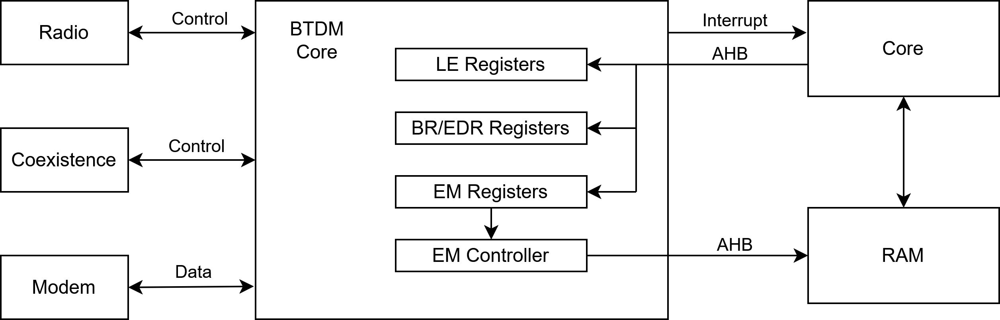
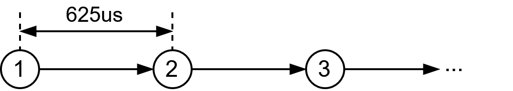
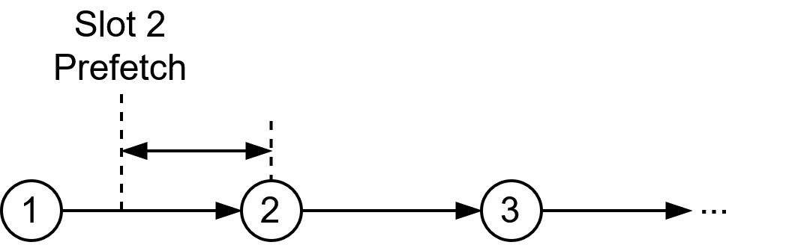

# ESP32 Bluetooth Core Documentation

This files try to document the Bluetooth Core peripheral in ESP32 devices.

The BTDM (BlueTooth Dual Mode) peripheral oversees aiding the main processor with time sensitive operations that would occupy too much time of the main ESP32 processor if this was not present.

## Architecture

On the left side of the above diagram, the BTDM peripheral relies on other peripherals such as a Radio, Modem or a Coexistence arbiter to send and receive RF information.
The interfaces used to talk to those peripherals have not yet been reverse engineered or documented.

On the right side of the diagram, the BTDM core communicates with the main ESP32 processing core via multiple interfaces.

- *Interrupts*: Signals that the BTDM Core can use to interrupt the main core, notifying the software that some Bluetooth event needs processing or some error has occurred.

- *Registers*: A special portion of memory that triggers behaviours inside the BTDM core depending on their value. The main core can read or write to change general peripheral options such as enabling and disabling, error reporting, timing and clock settings, exchange memory configuration, etc. Registers are mapped to AHB address `0x3ff71000`.

- *Exchange Memory*: Consisting on a portion of the general-purpose RAM that the BTDM and the main core share. This allows the BTDM Core to access general RAM in the same way as the main processor core can. The exchange memory will be used as the main Bluetooth information exchange mechanism, containing data buffers and operation control. In the ESP32, the exchange memory is mapped at `0x3ffb0000`.

## Prefetch Mechanism

The Exchange Memory contains the Exchange Table, which is a table of 16 consecutive event slots that can perform operations. This operations will be carried out synchronized to a 625uS timer to satisfy Bluetooth timing requirements.

In order to be able to execute the operation in time, the BTDM peripheral will prefetch the Exchange Memory instants before the event is due for execution.

The BTDM core will evaluate if there are pending operations for that Exchange Table entry and will carry them out. Otherwise, the slot will not execute any operation.

The user is expected to prepare all the Exchange Memory tables required to execute an event and, last, flag the event slot as ready to be processed in the Exchange Table.

## Registers

Peripheral registers will be documented via SVD files. They are available at <https://github.com/TarlogicSecurity/esp-pacs/tree/btdm> and will be tryed to upstream to <https://github.com/esp-rs/esp-pacs>.

## Exchange Memory

Exchange memory position is configurable and although in the ESP32 is mapped at `0x3ffb0000`, this can change. For this reason, it does not make sense to document the exchange memory in SVD files. For the time being, the EM will be directly documented in code in this repository and described here.

The Exchange Memory contains the Exchange Table, which is a table of 16 consecutive event slots that can perform operations.
Each entry defines what mode (BR/EDR or BLE) the event will run on and it contains a pointer to a Control Structure, located in the Exchange Memory.

Each Control Structure fields and sizes changes depending on the mode of the event but roughly contain the type and settings of the event, which can be advertisement, scan, connection or test mode. Also the Control Structure contains a pointer to a TX Descriptor.

TX Descriptors are linked lists structures that contains TX buffers and the metadata foreach buffer.

When the event is a RX event, the received data is accessed through a register that points to RX Descriptor.
RX Descriptors are linked lists structures that contain RX buffers and information asociated to the data received.
